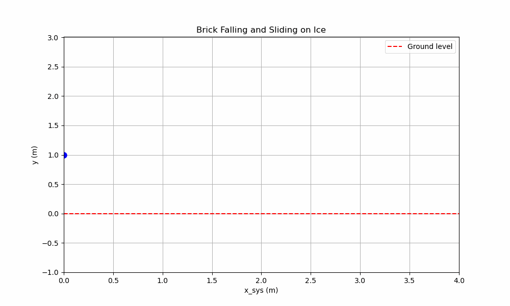
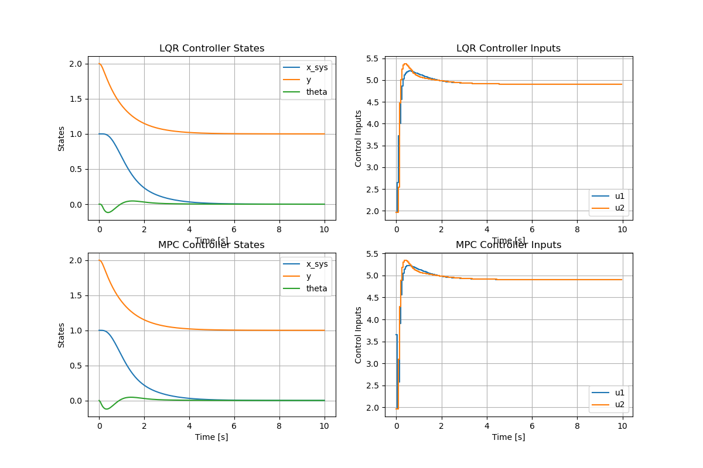
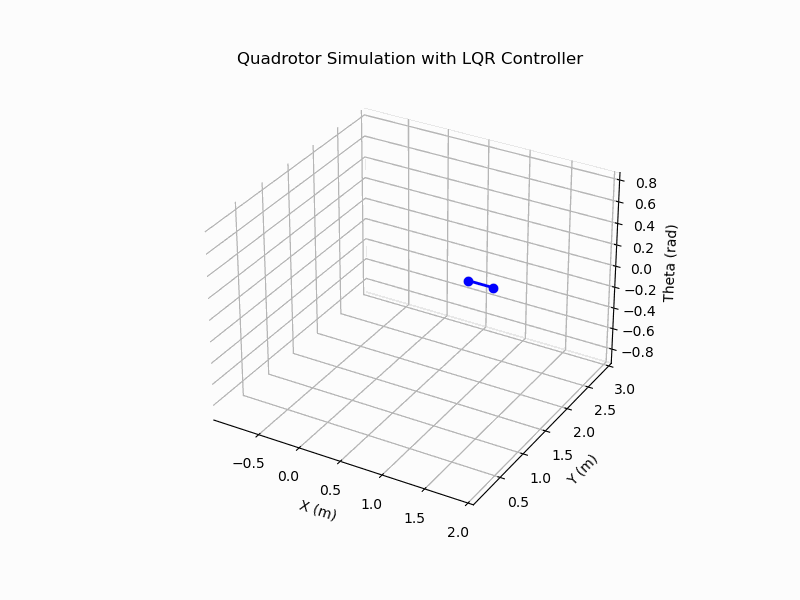
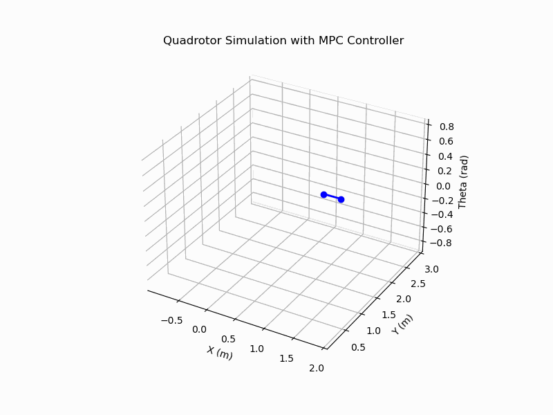
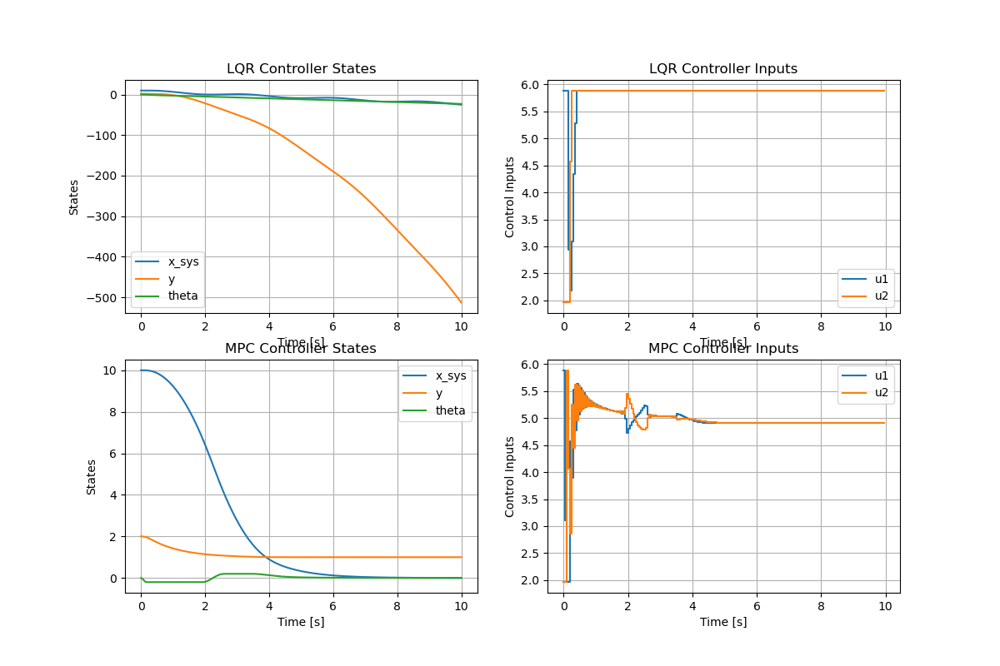
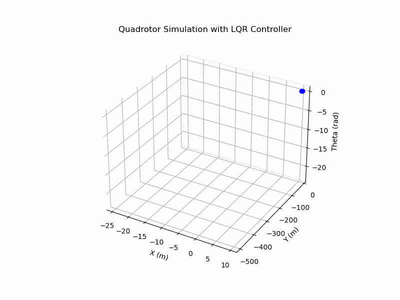
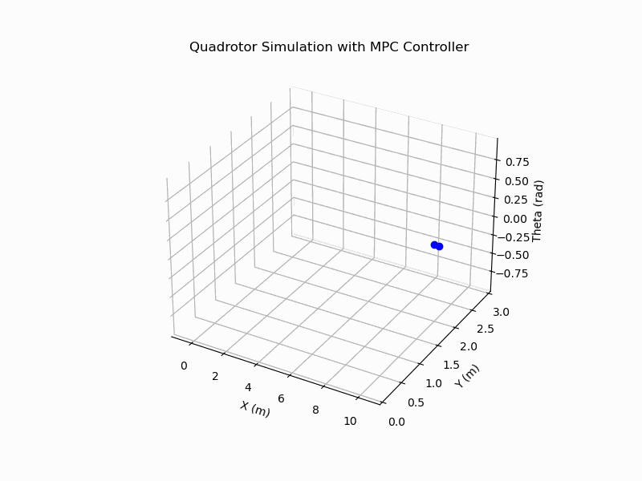
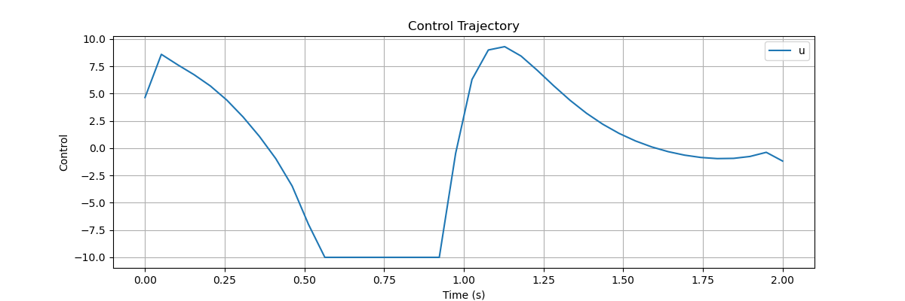
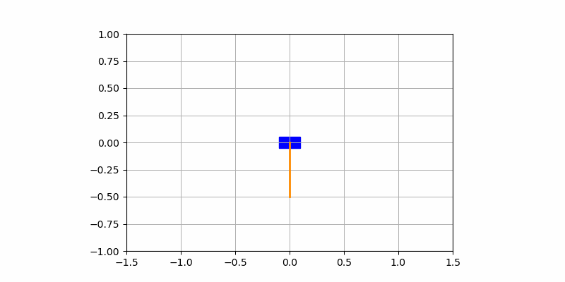

# HW Optimal Control (CMU 16-745, 2024)

This repository contains Python implementations of some assignments and in-class code for the Optimal Control course (CMU 16-745, Spring 2024). The in-class code was originally written in Julia. The repository focuses on numerical methods, system modeling, and optimal control strategies.

---

## 📚 Table of Contents

- [Introduction](#introduction)
- [Problem](#Problem)
---

## Introduction

This repository includes various homework problems and projects related to **optimal control**. It covers topics such as:
- Quadratic programming (QP)
- Liner Quadratic Regulator (LQR)
- Model predictive control (MPC)
- Control of dynamic systems

---

## Problem
##  0.Constrained Newton Method
- **Core Topics**: Full Newton Method, Gauss-Newton Method
- **Key Highlights**:
  - Implements Newton's method to solve constrained optimization problems, incorporating backtracking line search and regularization techniques.
- **Path**: `Newton_method/`
  - `constrained_min.py`: Main script to solve the constrained optimization problem.
## 1. Falling Brick
This module implements a simulation of a falling brick sliding on ice. The problem is formulated as a Quadratic Programming (QP) problem with equality and inequality constraints. 

- **Core Topics**: Augmented Lagrangian Method, Quasi-Newton Optimization
- **Key Highlights**:
  - Solves QP with constraints using an augmented Lagrangian framework.
  - Implements numerical gradient and mask matrices for inequality constraints.
  - Includes visualization of the brick's trajectory over time.
- **Path**: `falling_brick/`
  - `falling_brick_simulation.py`: Main script to simulate the falling brick and solve the QP problem.

---

## 2. 2D Drone
This module focuses on controlling a planar quadrotor to move towards a fixed point while respecting constraints. It uses Convex Model Predictive Control (MPC) to solve a constrained Linear Quadratic Regulator (LQR) problem.

- **Core Topics**: Convex MPC, Constrained LQR
- **Key Highlights**:
  - Simulates 2D quadrotor dynamics.
  - Implements both LQR and MPC controllers.
  - Solves the constrained LQR problem to achieve smooth, stable control towards the target.
  - Includes animated visualizations of the quadrotor's trajectory.
- **Path**: `2D_drone/`
  - `quadrotor_simulation.py`: Main script to simulate quadrotor control using MPC and LQR.

## Initial Point Close from Target
- **State and Control Trajectories**:
   
- **LQR**

- **MPC**

## Initial Point Far from Target
- **State and Control Trajectories**:
   
- **LQR**

- **MPC**

---

## 3. Cart-Pole Swing-Up
This module demonstrates the Direct Collocation method to solve the cart-pole swing-up problem. The goal is to swing the pendulum from a downward position to an inverted position by applying horizontal forces to the cart.

- **Core Topics**: Direct Collocation, Nonlinear Programming, Hermite-Simpson Integration
- **Key Highlights**:
  - Formulates the cart-pole dynamics using symbolic computation in CasADi.
  - Implements Hermite-Simpson constraints for trajectory optimization.
  - Visualizes state and control trajectories and provides an animated simulation.
- **Path**: `Cart-Pole-swingup//`
  - `DIRCOL.py`: Main script to solve the cart-pole swing-up problem.

### Visualization

1. **State Trajectories**:
   

2. **Control Trajectory**:
   

3. **Animated Simulation**:
   

