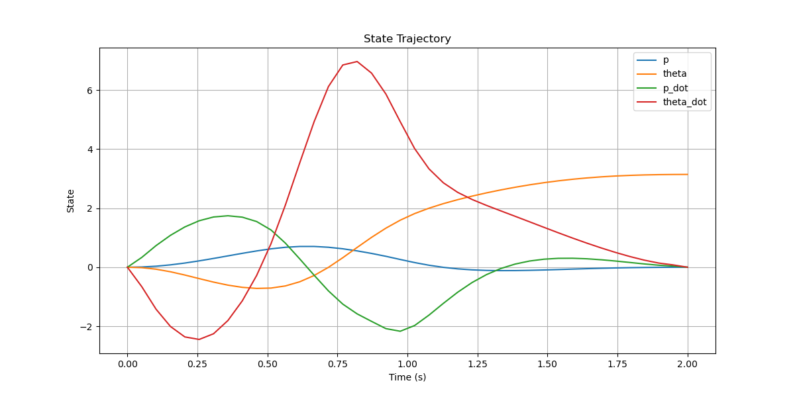

# HW Optimal Control (CMU 16-745, 2024)

This repository contains Python implementations of some assignments and in-class code for the Optimal Control course (CMU 16-745, Spring 2024). The in-class code was originally written in Julia. The repository focuses on numerical methods, system modeling, and optimal control strategies.

---

## 📚 Table of Contents

- [Introduction](#introduction)
- [Problem](#problem)
  - [0. Constrained Newton Method](#0-constrained-newton-method)
  - [1. Falling Brick](#1-falling-brick)
  - [2. 2D Drone](#2-2d-drone)
  - [3. Cart-Pole Swing-Up](#3-cart-pole-swing-up)
    - [3.1 Trajectory Generation with DIRCOL](#31-trajectory-generation-with-dircol)
    - [3.2 Trajectory Tracking with TV-LQR](#32-trajectory-tracking-with-tv-lqr)

---

## Introduction

This repository includes various homework problems and projects related to **optimal control**. It covers topics such as:
- Quadratic programming (QP)
- Linear Quadratic Regulator (LQR)
- Model predictive control (MPC)
- Control of dynamic systems

---

## Problem

### 0. Constrained Newton Method

- **Core Topics**: Full Newton Method, Gauss-Newton Method
- **Key Highlights**:
  - Implements Newton's method to solve constrained optimization problems, incorporating backtracking line search and regularization techniques.
- **Path**: `Newton_method/`
  - `constrained_min.py`: Main script to solve the constrained optimization problem.

### 1. Falling Brick

This module implements a simulation of a falling brick sliding on ice. The problem is formulated as a Quadratic Programming (QP) problem with equality and inequality constraints.

- **Core Topics**: Augmented Lagrangian Method, Quasi-Newton Optimization
- **Key Highlights**:
  - Solves QP with constraints using an augmented Lagrangian framework.
  - Implements numerical gradient and mask matrices for inequality constraints.
  - Includes visualization of the brick's trajectory over time.
- **Path**: `falling_brick/`
  - `falling_brick_simulation.py`: Main script to simulate the falling brick and solve the QP problem.
  

---

### 2. 2D Drone

This module focuses on controlling a planar quadrotor to move towards a fixed point while respecting constraints. It uses Convex Model Predictive Control (MPC) to solve a constrained Linear Quadratic Regulator (LQR) problem.

- **Core Topics**: Convex MPC, Constrained LQR
- **Key Highlights**:
  - Simulates 2D quadrotor dynamics.
  - Implements both LQR and MPC controllers.
  - Solves the constrained LQR problem to achieve smooth, stable control towards the target.
  - Includes animated visualizations of the quadrotor's trajectory.
- **Path**: `2D_drone/`
  - `quadrotor_simulation.py`: Main script to simulate quadrotor control using MPC and LQR.

#### Initial Point Close from Target

- **State and Control Trajectories**:
   
- **LQR**
  

- **MPC**
  

#### Initial Point Far from Target

- **State and Control Trajectories**:
   
- **LQR**
  

- **MPC**
  

---

## 3. Cart-Pole Swing-Up

This module demonstrates solving the cart-pole swing-up problem through two main stages: **Trajectory Generation** using the Direct Collocation (DIRCOL) method and **Trajectory Tracking** using the Time-Varying Linear Quadratic Regulator (TV-LQR) controller. The objective is to swing the pendulum from a downward position to an inverted position by applying horizontal forces to the cart.

- **Core Topics**: Direct Collocation, Nonlinear Programming, Hermite-Simpson Integration, Time-Varying LQR, Trajectory Tracking
- **Key Highlights**:
  - **Trajectory Generation**:
    - Formulates the cart-pole dynamics using symbolic computation in CasADi.
    - Implements Hermite-Simpson constraints for trajectory optimization.
    - Generates an optimal reference trajectory for the cart-pole system.
  - **Trajectory Tracking**:
    - Linearizes the system dynamics along the reference trajectory.
    - Computes time-varying LQR feedback gains using advanced discretization methods.
    - Simulates the system's response to follow the optimized trajectory.
    - Utilizes TV-LQR to achieve tracking of the reference trajectory in the presence of modeling errors.
    - Visualizes both the state/control trajectories and provides animated simulations for better understanding.

- **Path**: `Cart-Pole-swingup/`
  - `DIRCOL.py`: Main script to solve the cart-pole swing-up problem using Direct Collocation.
  - `TV_LQR_tracking.py`: Script implementing the Time-Varying LQR controller for trajectory tracking.
  - `state.png`: State trajectories generated by DIRCOL.
  - `control.png`: Control inputs generated by DIRCOL.
  - `cart-pole-swingup.gif`: Animated simulation of the swing-up maneuver using DIRCOL.
  - `state_control_static_plots.png`: Combined state and control trajectories from TV-LQR.
  - `trajectory_tracking_animation.gif`: Animated simulation showcasing TV-LQR trajectory tracking.

### 3.1 Trajectory Generation with DIRCOL

The **Trajectory Generation** phase utilizes the Direct Collocation (DIRCOL) method to compute an optimal trajectory that swings the pendulum from the downward to the inverted position.

- **Path**: `Cart-Pole-swingup/`
  - `DIRCOL.py`: Implements the DIRCOL method to solve the trajectory optimization problem.

#### Visualization

1. **State Trajectories**:
   
   *This plot illustrates the evolution of the cart-pole system's state variables over time, including position, angle, velocity, and angular velocity.*

2. **Control Trajectory**:
   
   *This plot displays the control inputs applied to the cart over time to achieve the swing-up maneuver.*

3. **Animated Simulation**:
   
   *An animation demonstrating the cart-pole system performing the swing-up maneuver, visualizing the movement of the cart and pendulum.*

### 3.2 Trajectory Tracking with TV-LQR

The **Trajectory Tracking** phase employs a Time-Varying Linear Quadratic Regulator (TV-LQR) to ensure that the cart-pole system follows the optimized reference trajectory generated by DIRCOL, even in the presence of modeling errors.

- **Path**: `Cart-Pole-swingup/`
  - `TV_LQR_tracking.py`: Implements the TV-LQR controller for trajectory tracking.

#### Visualization

4. **State and Control Trajectories with TV-LQR**:
   
   *This static plot combines the state trajectories and control inputs generated by the TV-LQR controller. It provides a comprehensive view of how the system states evolve in response to the control actions.*

5. **Trajectory Tracking Animation with TV-LQR**:
   
   *An animated simulation showcasing the TV-LQR controller's effectiveness in tracking the reference trajectory. It visually compares the reference and actual trajectories of the cart-pole system, highlighting the controller's performance.*

---

